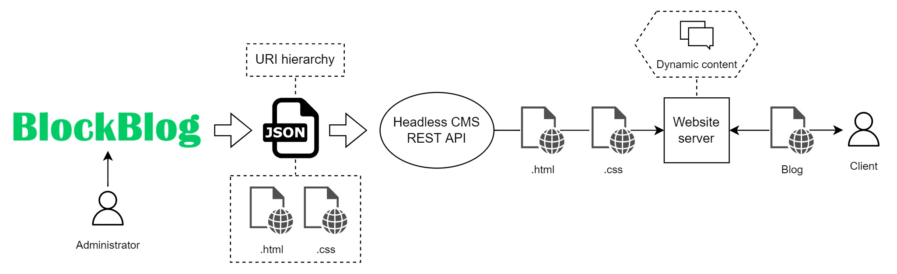
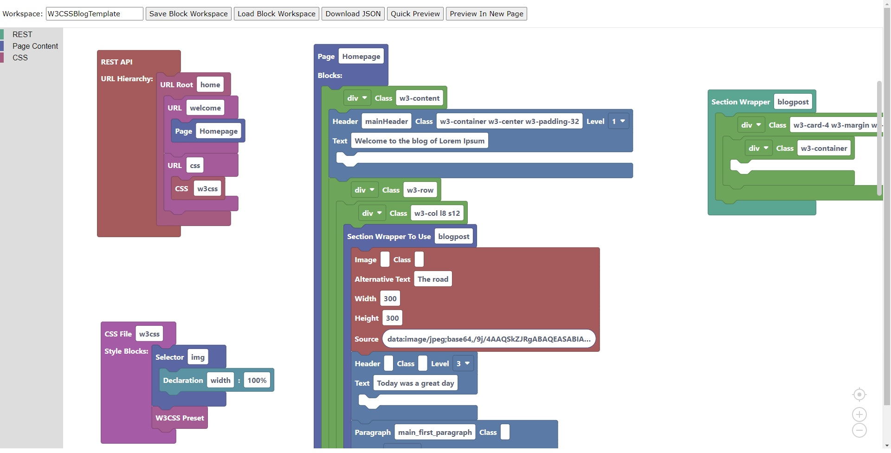
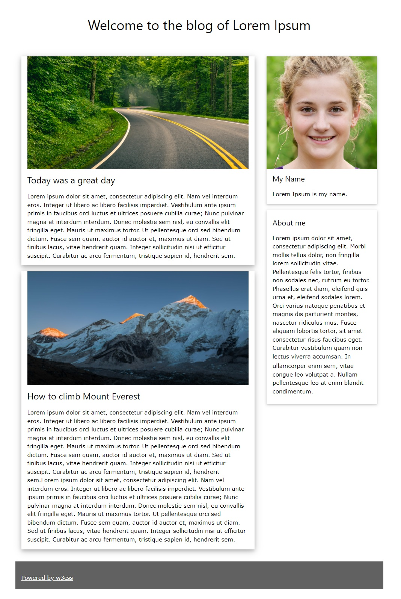

# BlockBlog
A visual domain-specific language for blog creation using blocks!
BlockBlog uses the [Blockly](https://developers.google.com/blockly) library to define its syntax.
The [W3CSS](https://www.w3schools.com/w3css/default.asp) library is presented as an option for blog creators to use in their created websites.
# The gist

BlockBlog adopts the ideas of Headless CMS architecture and aims to create a Headless CMS REST API that would allow clients to get static blog content.
The information in the blog or site and the URL hierarchy of REST API is described by dragging, dropping and connecting Blockly blocks.
Based on the graphical elements in the workspace, BlockBlog generates a JSON file, containing all the necessary information to create a Headless CMS REST API.

In order to prove that the chosen format is easily adaptable to specific platform needs, a Node.js Express local server was developed.
It parses the data from the JSON and creates a simple local REST API for static page content delivery.
# How to use
## Requirements
Node.js is required to use Blockly.
Express is required to launch the local server for REST API creation based on the generated JSON file.
## Launch BlockBlog
1. Pull the repo, make sure you have Node.js and npm installed.
2. In the *BlockBlog* directory run ```npm install Blockly```
3. Launch index.html with a browser.

**Note**: BlockBlog works on Chrome version 102.0.5005.63, other browser support is not guaranteed.

## Launch local server
1. In the *ExpressServer* directory run ```npm install express```
2. If necessary, overwrite the *blocklyREST.json* file with another *BlockBlog* REST API JSON file (obtained by pressing the *Download JSON* button in the workspace).
3. Launch the server with the command ```node server.js```
4. You should see the following message in the terminal:
```
Listening on port 3000
```
5. The static content can be accessed through the URL *http://localhost:3000/url_root* where the ```url_root``` should be replaced with an appropriate path in the REST API URI hierarchy. When a *GET* request is made, the client receives the appropriate file from the REST API. If there is no file linked to a specific endpoint, a message that the endpoint was created is displayed instead.
# The BlockBlog workspace
## Main functions
- **Save Block Workspace:** save all the blocks and their positions in an .xml file. The name of the file is the one specified in the workspace input field.
- **Load Block Workspace:** load blocks from an .xml file into the workspace. **This deletes all the current blocks on the workspace** before loading.
- **Download JSON:** download a JSON file based on the blocks created in the workspace. The downloaded file will be named *blocklyREST.json*. To use it with the local Express server see [instructions on how to launch the local server](#launch-local-server).
- **Quick Preview:** shows a preview of all pages created from the current workspace. The preview is displayed on top of a workspace and can be closed to return to the workspace.
- **Preview In New Page:** shows the preview of all pages created from the current workspace in separate browser tabs. Each page is generated in a separate tab.  
# Examples
Workspace .xml files can be loaded from the *Examples* folder.
Examples are mostly based on the usage of the W3CSS library for page style declaration.
# BlockBlog in action
## W3CSSBlogTemplate.xml

